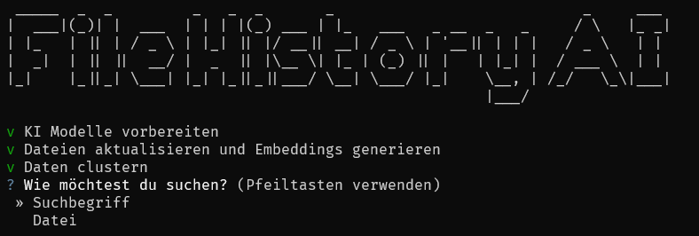

# Lost-Link

## Modelle

Dieses Programm nutzt folgende LLMs:
* [mxbai-embed-large](https://huggingface.co/ChristianAzinn/mxbai-embed-large-v1-gguf/resolve/main/mxbai-embed-large-v1.Q8_0.gguf?download=true)

## Installation

1. Erstelle ein neues Python venv:
 
    ``python -m venv venv``

2. Wechsle in das Erstelle venv:
    
    Powershell: ``./venv/Scripts/activate.ps1``  
    CMD: ``./venv/Scripts/activate.bat``

3. Installiere die benötigten Pakete:

    ``pip install -r requirements.txt``

4. *(Optional)* Für LlamaCpp GPU-Unterstützung aktivieren  
   Für GPU-Unterstützung folge [dieser Anleitung](https://llama-cpp-python.readthedocs.io/en/latest/). Für NVIDIA Grafikkarten kannst du CUDA nehmen, für andere Vulkan.

## Zu .exe konvertieren

Führe diesen Befehl im venv aus: ``pyinstaller .\LostLink.spec``  
Die fertige Exe wird dann im ``dist`` Ordner liegen